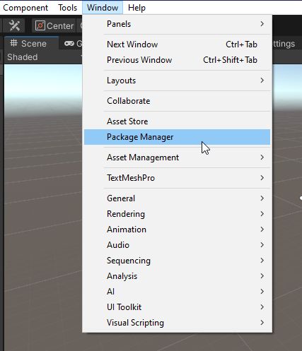
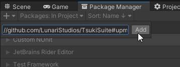

# TsukiSuite

<p>
    
    
    
</p>


TsukiSuite is an open source, free for commercial use suite of libraries created for making Unity development more
pleasant.

Each library can be compared as a version of Google's [Guava](https://github.com/google/guava), but created for Unity

Currently, four of those exists, but more will be added as the need for them surface

* Tsuki Runtime _(Core libraries & algorithms)_
* Tsuki Entities _(Gameplay Architecture)_
* Tsuki Editor _(Editor specific libraries)_
* Tsuki Graphs _([Graph Theory](https://en.wikipedia.org/wiki/Graph_theory) libraries)_

## Installation

1. Install **Unity 2020.3** or older
2. Open Unity Package Manager.  
   
3. Click on the the '+' icon, add package from git URL, as paste the following url: `https://github.com/LunariStudios/TsukiSuite.git#upm`.  
   
4. Wait for the download and you are done! You can now freely use Tsuki
## Features and examples

* Collections
   ```csharp
   List<int> list = new List<int>();
   if (list.IsEmpty()) {
       Debug.Log("Is empty!");
   }
   ```
   ```csharp
   public struct Data {
       public string Name;
       public int Priority;
   }
   
   List<Data> data = PopulateListWithRandomData();
   Data withHighestPriority = data.MaxBy(d => d.Priority)
   ```
* Colors
    ```csharp
    Color color = Colors.RandomColor();
    Color newColor = color.SetHue(Mathf.Sin(Time.time));
    ```
    ```csharp
    Color a = new Color(1, 0, 1, 1);
    ColorHSV b = a;
    ColorHSV colorHSV = new ColorHSV(0, 1, 1, 1);
    Color c = colorHSV;
    ```
* Editor
    ```csharp
    // Bonus: A list of hidden UnityEditor GUIStyles!
    var style = GUIStyles.Get(GUIStyles.box);
    var labelRect = position.GetLine(2); 
    EditorGUI.LabelField(labelRect, "I am on the third with the console info style!", style);
    ```
* UI
    ```csharp
    // No need to declare a copy of Graphic.color
    Text.SetAlpha(Mathf.Sin(Time.time));
    Text.SetHue(Mathf.Cos(Time.time));
    ```
* And many more

## Planned features

* Code Generation tool using T4 templates.
* Best practices knowledge base and bad practice detection.